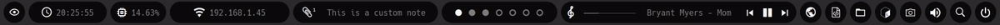

# **Bubble Polybar**

**Bubble Polybar** is designed to prioritize **user comfort** and **elevate productivity** on Linux systems. These Polybar dotfiles have been curated with a keen emphasis on **streamlining your experience**, offering a **seamless computing environment**.

Here are some examples of how this bar looks with some **color presets** (learn how to customize **colors** [here](#change-colors)):

<a href="color-presets/night-blue/colors.txt">

## Installation
### **Install Polybar**
Ensure you have **Polybar** installed in your system (you can use the packet manager of your Linux distribution to install it).
- **Debian**:

		$: sudo apt install polybar
- **Fedora**:

		$: sudo dnf install polybar
- **openSUSE**:

		$: sudo zypper install polybar
- **Arch**:

		$: sudo pacman -S polybar
If you prefer to **build it from source**, you can download it from [the official Polybar GitHub repository](https://github.com/polybar/polybar).
### **Install dependencies**
In order to run this polybar dotfiles, you have to install the following dependencies:
- **bash**, **zsh**, **net-tools**, **sed**, **bc**, **awk**, **coreutils**, **grep**, **ffmpeg**, **procps-ng**, **cron**, **python3** (install them through the packet manager of your linux distribution).
- **spotify-cli** (install it through **pip**):

		$: pip install spotify-cli-linux
	If it shows an "externally-managed-environment" error, try this:

		$: pip install spotify-cli-linux --break-system-packages
- **CodeNewRoman Nerd Font** (download it from [Nerd Fonts](https://www.nerdfonts.com/font-downloads)) and **Hack Font** (download it from [source-foundry's GitHub](https://github.com/source-foundry/Hack/releases/tag/v3.003)). Unzip them and place them in **/usr/share/fonts**.

		$: unzip folder.zip
  		$: sudo mv folder /usr/share/fonts
### **Install Bubble Polybar**
Clone this repository into the **~/.config/polybar** directory (create it if doesn't exist).

	$: mkdir -p ~/.config/polybar
	$: cd ~/.config/polybar
	$: git clone https://github.com/wdeloo/bubble-polybar
Edit the **cron** file running the following command:

	$: crontab -e
Add the following line to the opened file:

	* * * * * ~/.config/polybar/scripts/xip/xcc.sh
## Run Bubble Polybar
To **run** or **refresh** the bubble polybar run the "**bubble-run.sh**" script:

	$: ~/.config/polybar/scripts/bubble-run.sh
## Customize Bar

### **Change Colors**
To change the colors, you have to edit the **~/.config/polybar/bubble-polybar/scripts/colors.txt** file.

	$: nano ~/.config/polybar/bubble-polybar/scripts/colors.txt
**DONT FORGET TO REFRESH THE POLYBAR AFTER MAKING ANY CHANGE IN THE BAR**:

	$: ~/.config/polybar/scripts/bubble-run.sh
